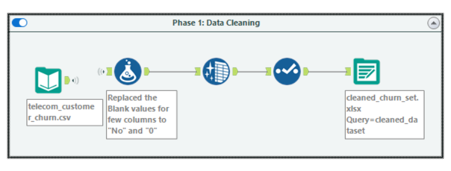
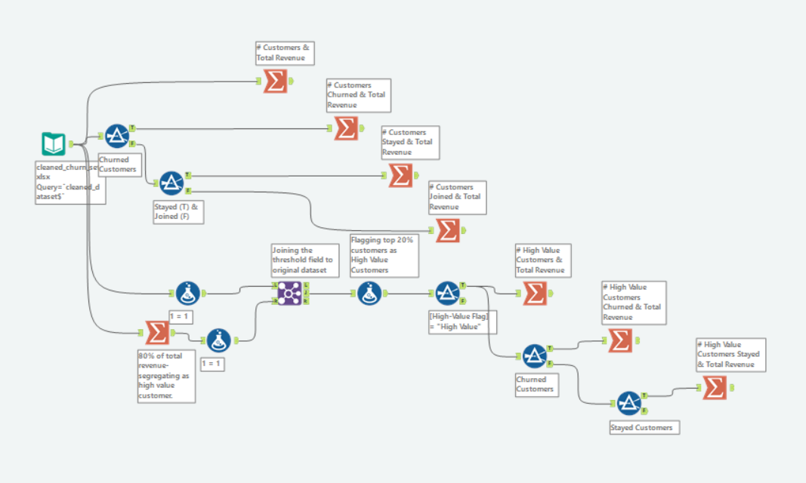
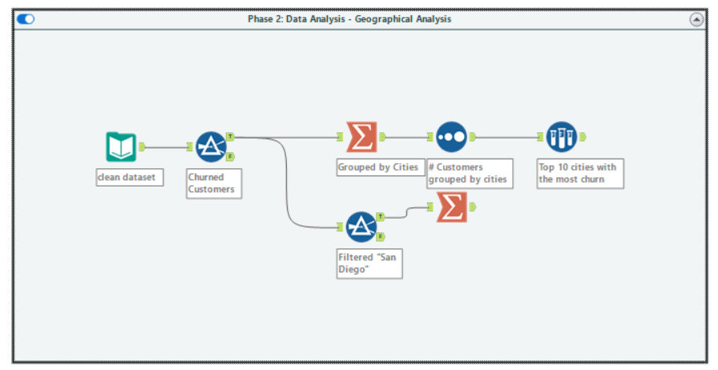
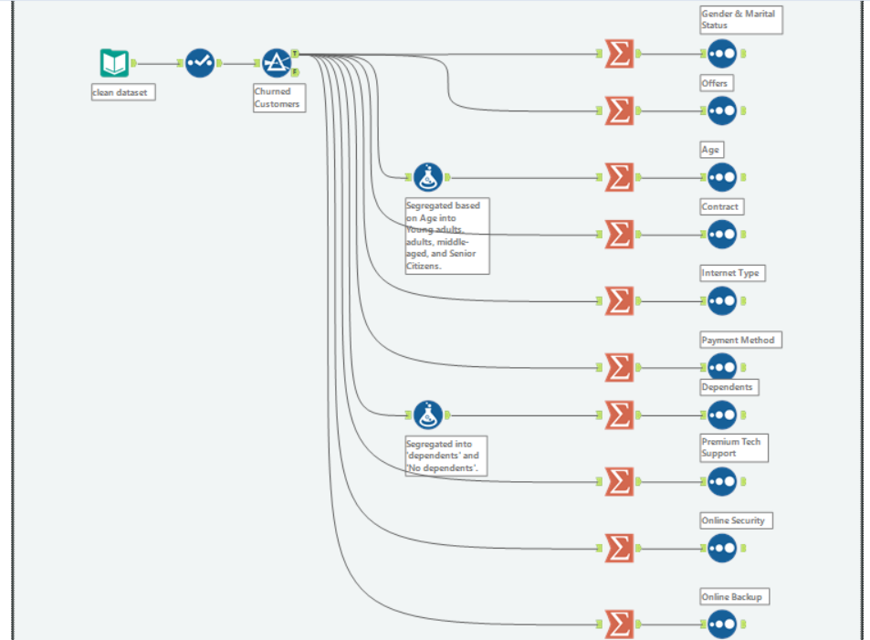

# Data Analysis in Alteryx

There were 2 phases involved - Data Cleaning and Data Analysis. 

The Data Analysis includes 3 parts - BANs, Geographical Analysis and Customer Churn Profile Characteristics.

### Phase 1 - Data Cleaning :

### Phase 2 - Data Analysis - BANs :

### Phase 2 - Data Analysis - Geographical Analysis :

### Phase 2 - Data Analysis - Customer Churn Profile Characteristics and the risk factors :

